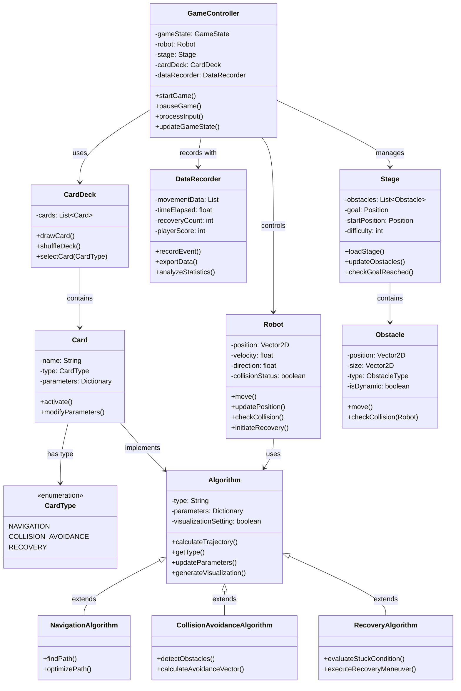

# Nav Card - Robot Navigation Strategy Game

## Developer
- Napat Sirichan 6710545571 (GitHub: NapatzZ)

## Project Presentation Video
[YouTube Link]

## Project Description
Nav Card is a 2D strategy game that combines card selection with algorithm-driven robot navigation. Players choose three algorithm cards before starting each stage: one for navigation, one for collision avoidance, and one for recovery behavior. The selected algorithms dictate how the in-game robot navigates a dynamic environment filled with obstacles and hazards. The goal is to complete the stage within a set limit of recovery attempts and/or by beating the best time, with leaderboards to compare performances.

### Key Features
- **Card-Based Algorithm Selection**: Players choose and tweak algorithm cards, adding strategic depth.
- **Data Analytics Integration**: Detailed statistical tracking of player performance (e.g., movement efficiency, recovery attempts).
- **Dynamic Environments**: Levels feature dynamically changing obstacles, making real-time algorithm adjustments critical.
- **Interactive Leaderboards**: Players can compare performance metrics globally, encouraging continual optimization.

## Design

### Core Game Concept
The game integrates card selection mechanics with robot navigation challenges. Players must strategically select algorithm cards that work well together to overcome obstacles efficiently. Each stage presents unique challenges that require different algorithm combinations for optimal performance. The player's success is measured both by completion time and the number of recovery attempts needed, encouraging experimentation with different card combinations.

### UML Class Diagram

## Data Component

### Stored Data
- Robot Position Tracking: Records x-y coordinates and the distance traveled over time
- Recovery Attempts: Records each time a recovery behavior is triggered
- Time to Completion: Total time taken to finish each stage
- Obstacle Collision Count: Records collision counts with obstacles
- Algorithm Card Combinations: Records which card combinations were used in each attempt

### Data Analysis
We use matplotlib and pandas libraries to analyze and visualize gameplay data with the following visualizations:
- Heatmap showing robot movement density across the map, highlighting frequent paths and stuck points
- Bar chart comparing recovery attempts across different algorithm combinations
- Line graph showing completion time across multiple attempts, with trend lines indicating player improvement
- Bar chart showing collision frequency by obstacle type
- Stacked bar chart showing success rates of different algorithm combinations

## Future Development Plans
- Add new algorithm cards with different navigation strategies
- Implement an online system for players to compete and share algorithm combinations
- Add an achievements system to increase challenges and replayability
- Create more complex stages with environmental hazards beyond static obstacles
- Develop a tutorial system for new players to understand algorithm effects 