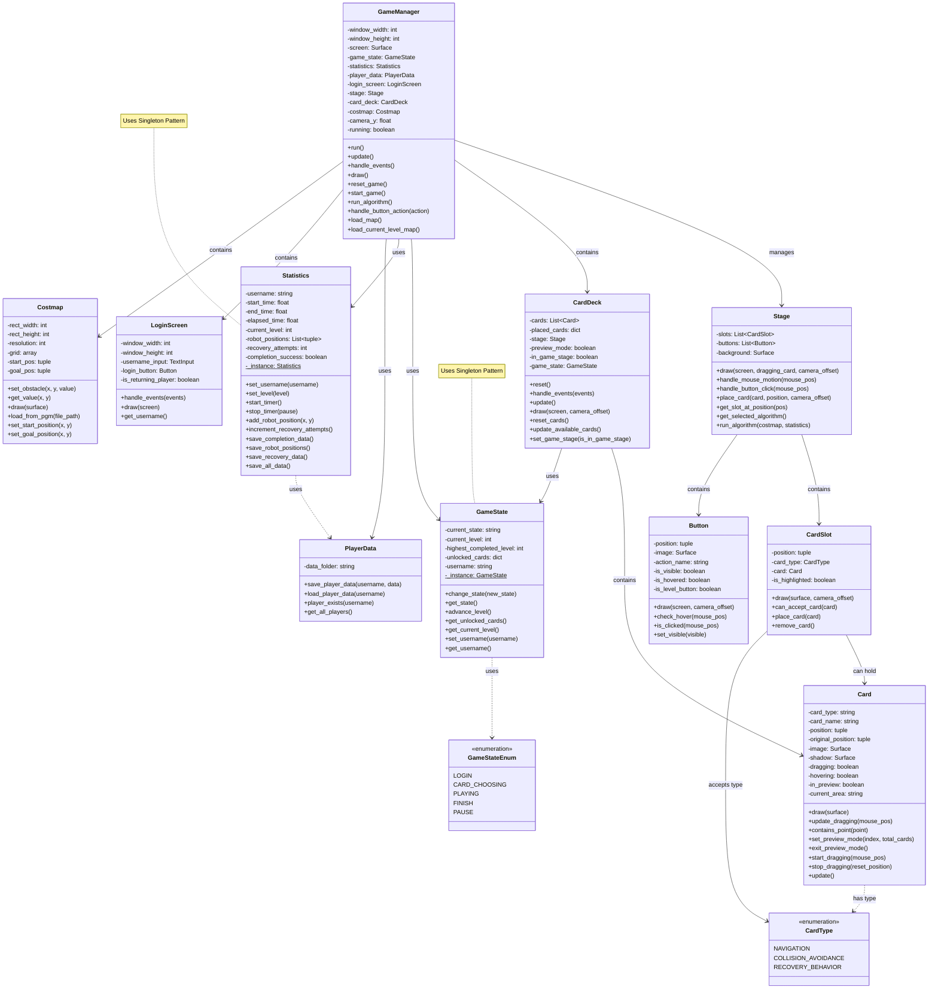
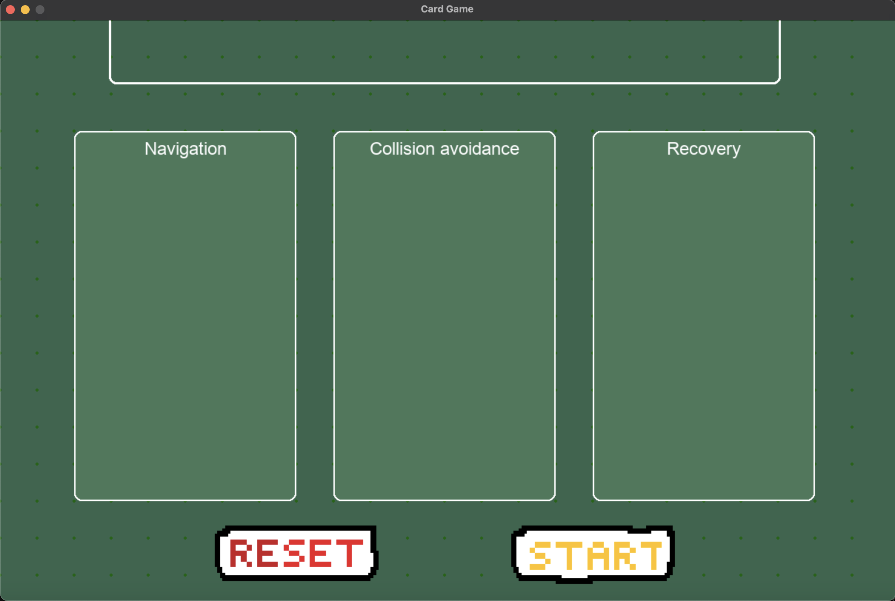
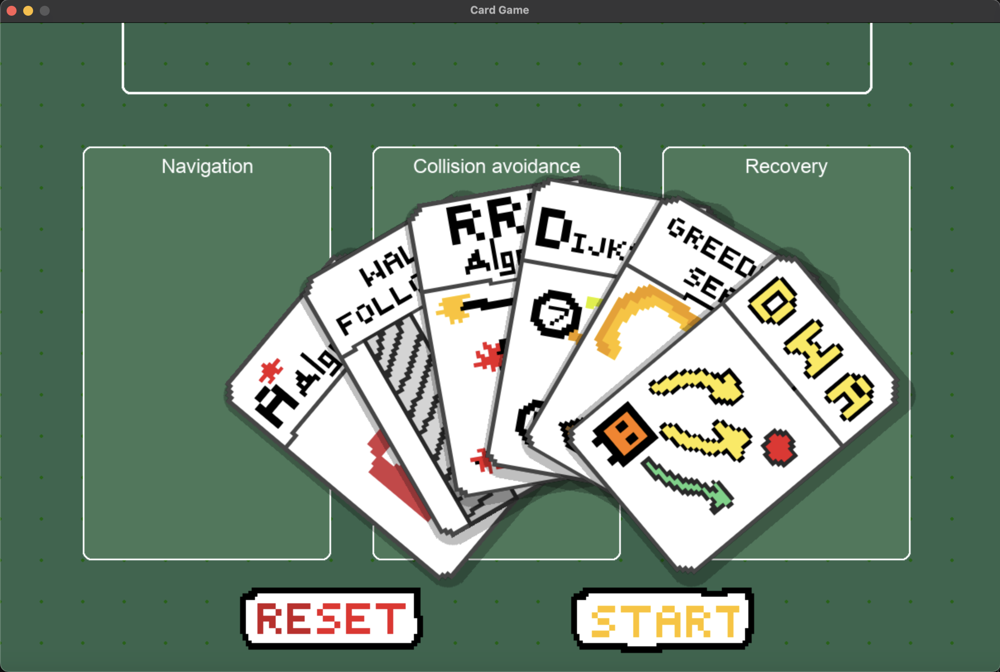
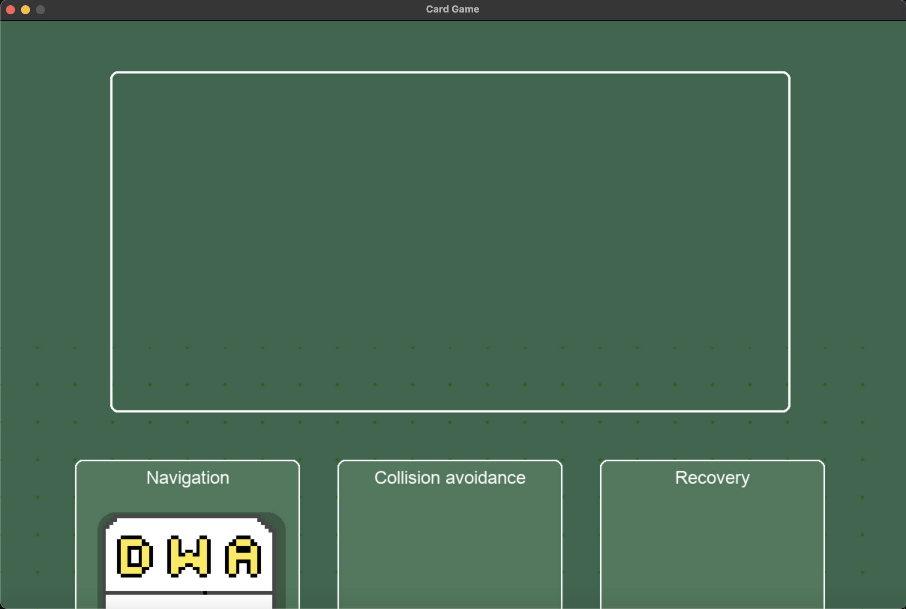

# Nav Card - Robot Navigation Strategy Game

## Napat Sirichan (6710545571)
**Student ID:** 6710545571  
**GitHub Repository:** [https://github.com/NapatzZ/nav-card](https://github.com/NapatzZ/nav-card)  
**Presentation Video:** [https://youtu.be/UiahhboP96E](https://youtu.be/UiahhboP96E)  
**Project Proposal Document:** [https://docs.google.com/document/d/1mw-oxGlZhXtPc57PVRvUYbVn2kGAJZG0VwvRZMZ3bZ4/edit?usp=sharing](https://docs.google.com/document/d/1mw-oxGlZhXtPc57PVRvUYbVn2kGAJZG0VwvRZMZ3bZ4/edit?usp=sharing)

## ♥︎ Overview and Concept

Nav Card is a 2D strategy game developed with Python and Pygame that combines algorithm card selection with robot navigation. Players choose three cards before starting each level: one card for navigation, one card for obstacle avoidance, and one card for recovery behavior. The selected algorithm set determines how the robot navigates through environments filled with obstacles and hazards.

The Nav Card project presents a unique approach to studying robot navigation algorithms with the following key features:

- **Login System and Progress Tracking:** Players can create profiles and save their progress, including unlocking new algorithm cards as they complete levels.
- **Diverse Card System:** Various navigation algorithms ranging from basic ones like DFS, BFS to advanced ones like A*, RRT.
- **In-depth Data Presentation:** Records and analyzes the performance of each algorithm set, allowing players to understand the strengths and weaknesses of each algorithm.
- **Clean User Interface:** Designed for ease of use, emphasizing clear visualization of algorithm operations. During gameplay, all UI buttons are hidden to maximize display area.

The main concept of Nav Card is to make learning robot navigation algorithms fun and accessible by combining engaging game mechanics with in-depth data analysis.

## 📜 UML Class Diagram

## 🔑 Key Features

- **User Account System:** Create accounts and store individual player progress
- **Algorithm Card System:** Select three types of cards to control robot behavior
- **Multiple Difficulty Levels:** Each level presents different challenges
- **Algorithm Card Unlocking:** Players receive new cards as they complete levels
- **Fan-out Card Display Mode:** Display all cards in a fan layout for easy selection
- **Robot Path Visualization:** View the path the robot takes based on the selected algorithms
- **Recovery System:** Manage situations when the robot gets stuck or can't find a path
- **Detailed Statistics Collection:** Record and analyze the performance of each algorithm
- **Collected Data Visualization:** Display statistics through easy-to-understand tables and graphs
- **Clean User Interface:** During gameplay, all UI buttons are hidden to focus on algorithm operation
- **Singleton Pattern Implementation:** Game state and statistics management use the Singleton pattern to ensure consistent data across the application

## 🧮 User Interface

### Card Selection View

### Fan-out Display Mode

### Game Stage View

## 📊 Data Analysis

Nav Card helps players understand the performance of various algorithms through collection and analysis of multi-dimensional data:

### Collected Data:
1. **Robot Positions:** Records x-y coordinates and time throughout the game
2. **Recovery Data:** Records points where recovery was needed and the type of recovery used
3. **Mission Time:** Tracks time taken to complete each level
4. **Attempts and Success:** Records number of attempts and successes for each level
5. **Algorithm Performance:** Compares performance of different algorithm sets

### Analysis and Visualization:
- **Recovery Heat Maps:** Shows where robots frequently get stuck on maps
- **Algorithm Comparison Graphs:** Compares time and efficiency of different algorithms
- **Progress Charts:** Shows player development and learning over time

## 📡 Core Technologies
- Python 3.8+
- Pygame 2.0.1+
- NumPy (for calculations and data management)
- JSON (for user data storage)
- CSV (for game statistics recording)

## 🖥️ Installation
1. Make sure you have Python 3.8 or newer installed on your system
2. Install required Python packages: `pip install -r requirements.txt`

## 🧑‍💻 Starting the Game
1. Navigate to the project directory in your terminal
2. Start the game using the command: `python main.py`

## Controls
- **Spacebar**: Toggle card view mode
- **Left Click**: Select and place cards
- **Start Button**: Begin simulation when cards are placed
- **Reset Button**: Reset game state to choose cards again
- **ESC**: Pause game/resume play

## Developed by
Napat Sirichan (6710545571)

## Version
**Version:** 1.0