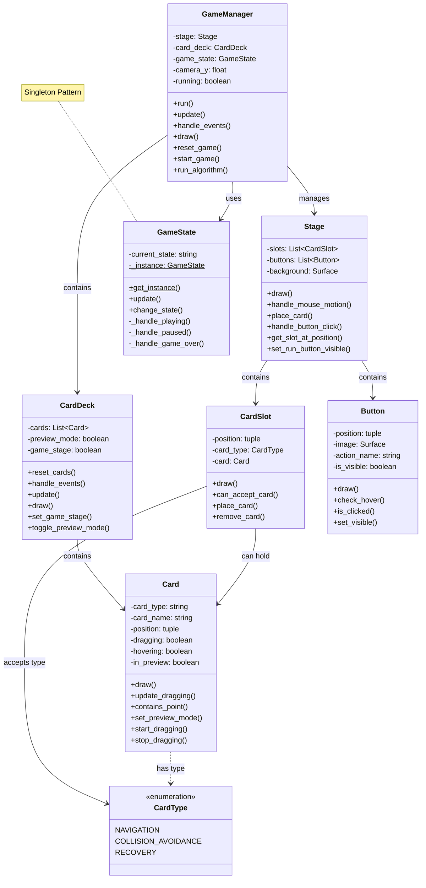

# Nav Card - Robot Navigation Strategy Game

## 1. Project Overview
Nav Card is a 2D strategy game that combines card selection with algorithm-driven robot navigation. Players choose three algorithm cards before starting each stage: one for navigation, one for collision avoidance, and one for recovery behavior. The selected algorithms dictate how the in-game robot navigates a dynamic environment filled with obstacles and hazards. The goal is to complete the stage within a set limit of recovery attempts and/or by beating the best time, with leaderboards to compare performances.

## 2. Project Review
Most robot navigation simulations are designed for technical users and lack the accessibility needed for beginners to understand how different algorithms work. This project aims to:
- **Enhance Learning**: By visualizing how different navigation algorithms perform in real-time
- **Increase Interactivity**: By allowing players to experiment with different algorithm combinations
- **Improve Understanding**: Through a card-based interface that makes complex algorithmic concepts more approachable

## 3. Programming Development

### 3.1 Game Concept
The game simulates robot navigation through obstacle-filled environments. The primary objective is to reach the goal position with minimal recovery attempts and in the shortest time possible. The game integrates traditional navigation algorithms with a card-based selection system to make learning these concepts fun and interactive.

### 3.2 Object-Oriented Programming Implementation
The project is structured into separate components:

**Game Manager**:
- **Role**: Manages overall game flow (board state, user input, turn switching, and statistics tracking)
- **Key Attributes**:
  - `stage`: Current level the player is attempting
  - `camera_y`: Controls the view between card selection and gameplay areas
  - `running`: Tracks if the game is currently active
- **Key Methods**: `run()`, `update()`, `handle_events()`, and `draw()`

**Card Deck**:
- **Role**: Handles the collection of algorithm cards and their interactions
- **Key Attributes**:
  - `cards`: List of available algorithm cards
  - `preview_mode`: Tracks whether cards are displayed in fan-out view
  - `game_stage`: Indicates whether gameplay has started (vs. card selection phase)
- **Key Methods**: `reset_cards()`, `handle_events()`, `update()`, and `draw()`

**Card (Base Class)**:
- **Role**: Defines common attributes and methods for algorithm cards
- **Key Attributes**:
  - `card_type`: Type of algorithm (Navigation, Collision avoidance, Recovery)
  - `card_name`: Specific algorithm name (e.g., A*, DWA)
  - `position`: Current position on screen
  - `dragging`: Whether the card is being dragged
- **Key Methods**: `draw()`, `update_dragging()`, `contains_point()`, `set_preview_mode()`

**Stage**:
- **Role**: Manages the playfield area, card slots, and game environment
- **Key Attributes**:
  - `slots`: Card placement slots for the three algorithm types
  - `buttons`: Interactive buttons (start, reset)
  - `background`: Game environment background
- **Key Methods**: `draw()`, `handle_mouse_motion()`, `place_card()`, `handle_button_click()`

**GameState (Singleton)**:
- **Role**: Manages the current state of the game using the Singleton pattern
- **Key Attributes**:
  - `current_state`: Current state of the game (e.g., "PLAYING", "PAUSED")
  - `_instance`: Static instance of the class (Singleton pattern)
- **Key Methods**: `get_instance()`, `update()`, `change_state()`

**UML Diagram**:

### 3.3 Design Patterns Implemented
- **Singleton Pattern**: Used for the GameState class to ensure only one instance exists throughout the application. This pattern ensures consistent state management across the entire game.
- **Observer Pattern**: Used for handling events and user interactions, allowing different components to react to changes in the game state.

### 3.4 Game Flow and Controls
- **Selection Phase**: Players select algorithm cards and place them in appropriate slots
- **Gameplay Phase**: Once the Start button is pressed, all UI buttons disappear, and the player can run the algorithm by pressing the 'o' key
- **Reset**: Returns to the selection phase, restoring all buttons and allowing different card selections

### 3.5 Algorithms Involved
- **Move Validation**: Checking if a card can be placed in a specific slot based on card type
- **Card Visualization**: Displaying cards in a fan-out pattern when in preview mode
- **Camera Animation**: Smooth transition between card selection screen and gameplay area
- **Event Handling**: Managing user inputs (mouse clicks, drags) and updating the game state
- **Data Logging**: Recording gameplay metrics (algorithm choices, completion time, etc.) for future analysis

## 4. Statistical Data (Prop Stats)

### 4.1 Data Features
The game will record:
- Robot Path Length per Stage
- Number of Recovery Attempts
- Completion Time per Stage
- Algorithm Combinations Used
- Obstacle Collision Frequency

### 4.2 Data Recording and Analysis
**Storage**:
- Data will be stored in JSON format for easy access and manipulation

**Analysis**:
- Basic statistical measures (mean, minimum, maximum, and standard deviation) will be calculated
- Performance comparisons between different algorithm combinations

### 4.3 Data Analysis Report
**Table Presentation**:
"Algorithm Performance Comparison" will be summarized in a table showing:
- Algorithm Combination
- Average Completion Time
- Average Recovery Attempts
- Success Rate

**Graph Presentation**:
Three graphs will be generated:

1. **Robot Path Efficiency**:
   - Graph Type: Line chart (attempt number vs. path length)
   - Shows improvement over multiple attempts

2. **Algorithm Combination Performance**:
   - Graph Type: Bar chart (algorithm combinations vs. completion time)
   - Compares effectiveness of different algorithm sets

3. **Recovery Attempt Distribution**:
   - Graph Type: Heatmap overlaid on stage map
   - Shows locations where recovery events frequently occur

## 5. Project Timeline

| Week | Task | Status |
|------|------|--------|
| Week 1 (March) | Proposal submission / Project initiation | Completed |
| Week 2 | Design system architecture, create UML diagram | Completed |
| Week 3 | Develop core classes (GameManager, Card, CardDeck) | Completed |
| Week 4 | Implement card selection interface and preview mode | Completed |
| Week 5 | Create stage environment and robot navigation display | Completed |
| Week 6 (by April 16) | Complete card placement system and camera transitions | Completed |
| Week 7 | Implement design patterns (Singleton) and improve UI | Completed |
| Week 8 | Develop data collection framework and visualization | In Progress |
| Final Week | Polish user interface, finalize documentation | Pending |

## 6. Document Version
Version: 1.2

## 7. Statistical Data Revision

### 7.1 Table Presentation
We focus on "Algorithm Performance" with:
- Success Rate: Percentage of successful stage completions
- Average Completion Time: Mean time to reach goal position
- Average Recovery Count: Mean number of recovery events triggered
- Path Efficiency: Path length vs. optimal path length

### 7.2 Graph Presentation

| Feature Name | Graph Objective | Graph Type | X-axis | Y-axis |
|--------------|----------------|------------|--------|--------|
| Algorithm Performance | Compare effectiveness of algorithms | Bar chart | Algorithm Combination | Average Completion Time |
| Recovery Attempts | Show recovery frequency by location | Heatmap | X Position | Y Position |
| Path Efficiency | Track improvement over time | Line graph | Attempt Number | Path Length Ratio |

## 8. Project Planning

### 8.1 Weekly Planning
**March 26 – April 2**:
Finalize project structure; set up basic user interface (window, card deck, stage); begin implementing core classes.

**April 3 – April 9**:
Complete Card and CardDeck classes; implement card dragging and positioning; create preview mode visualization.

**April 10 – April 16 (50% Milestone)**:
Ensure all core classes are functional; validate card placement logic; implement camera transitions between card selection and game stage; basic gameplay loop operates correctly.

**April 17 – April 23**:
Begin implementing robot navigation visualization based on selected cards; add data collection framework; create stage obstacles and goal visualization.

**April 24 – May 11**:
Finalize data presentation (tables and graphs for algorithm performance); complete UI polishing; perform comprehensive testing and debugging; prepare final documentation.

### 8.2 Current Progress (75% Completion)
**Completed Tasks**:
- Core classes (GameManager, Card, CardDeck, Stage) are operational
- Card selection, dragging, and placement functionality implemented
- Preview mode (fan-out display) is working
- Camera transition between selection and gameplay screens
- Basic UI elements (buttons, card slots) are functional
- Robot navigation visualization based on selected algorithms
- Implementation of Singleton pattern for GameState
- Improved UI with dynamic button visibility during gameplay
- Keyboard controls for algorithm execution ('o' key)

**Remaining Tasks**:
- Complete data collection framework
- Implement performance visualization
- Add additional algorithm cards
- Final testing and debugging
- Complete documentation

## GitHub Repository
https://github.com/NapatzZ/nav-card 