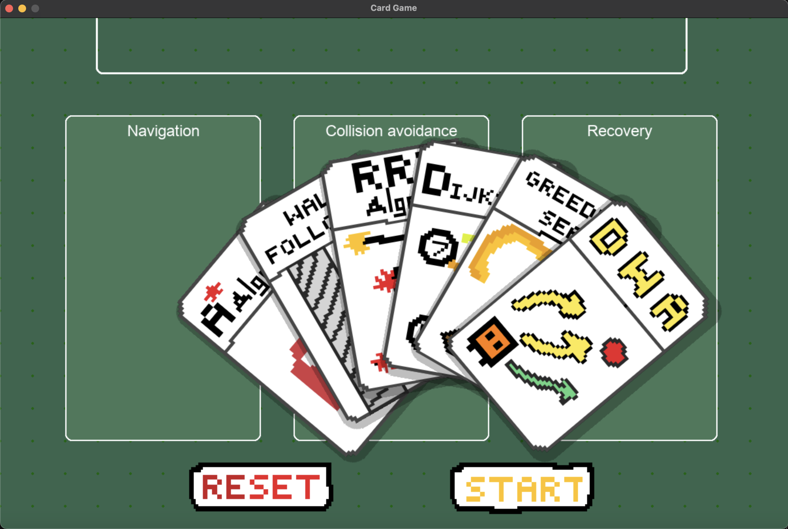
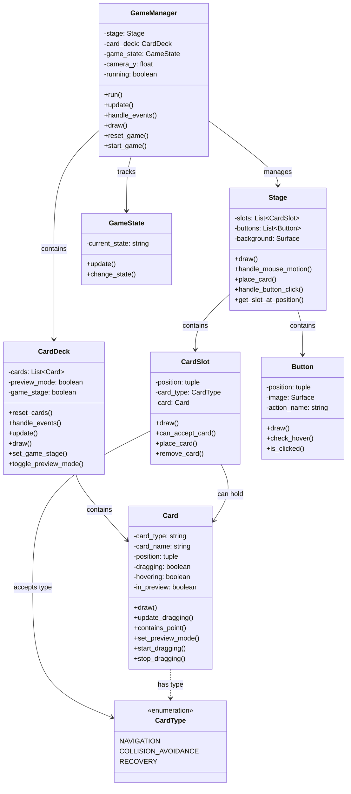

# Nav Card

## Project Overview
Nav Card is a 2D strategy game that combines card selection with algorithm-driven robot navigation. Players choose three algorithm cards before starting each stage: one for navigation, one for collision avoidance, and one for recovery behavior. The selected algorithms dictate how the in-game robot navigates a dynamic environment filled with obstacles and hazards. The goal is to complete the stage within a set limit of recovery attempts and/or by beating the best time, with leaderboards to compare performances.

For a more detailed project description, check out our [DESCRIPTION.md](DESCRIPTION.md) file.

## Game Screenshots

### Card Selection View

### Fan-out Display Mode

### Game Stage View

## Game Mechanics
- At the start of each stage, players select one card each for navigation, collision avoidance, and recovery behavior.
- The robot navigates a 2D map filled with static and dynamic obstacles based on the selected algorithms.
- The stage is completed by reaching the goal while minimizing recovery attempts and finishing within the best possible time.

## Game Objectives
- Complete stages within a predefined recovery limit.
- Beat the record times of previous attempts and other players.

## Key Features
1. **Card-Based Algorithm Selection**: Instead of preset robot behaviors, players choose and tweak algorithm cards, adding strategic depth.
2. **Data Analytics Integration**: Detailed statistical tracking of player performance (e.g., movement efficiency, recovery attempts) allows for in-depth analysis and feedback.
3. **Dynamic Environments**: Levels feature dynamically changing obstacles, making real-time algorithm adjustments critical.
4. **Interactive Leaderboards**: Players can compare performance metrics globally, encouraging continual optimization of their algorithm strategies.

## Project Architecture

### UML Class Diagram

## Algorithm Cards
The game includes various algorithm cards that players can choose from:

### Navigation Algorithms
- **A*** - An efficient pathfinding algorithm that uses heuristics to find the shortest path
- **Dijkstra** - A classic pathfinding algorithm that guarantees the shortest path
- **RRT (Rapidly-exploring Random Tree)** - A randomized algorithm for efficient space exploration
- **Greedy Search** - A fast but potentially suboptimal pathfinding approach

### Collision Avoidance Algorithms
- **DWA (Dynamic Window Approach)** - Considers robot dynamics for smooth obstacle avoidance
- **Wall Following** - A simple algorithm that follows walls to navigate around obstacles

### Recovery Behaviors
- Various strategies for recovering from stuck situations or collisions

## Statistical Data Tracking
The game tracks the following features during gameplay:
1. **Robot Position Tracking**: Records x-y coordinates and the distance traveled over time.
2. **Recovery Attempts**: Records each time a recovery maneuver is executed.
3. **Stage Completion Time**: Total time taken to finish each stage.
4. **Player Score/Time Records**: Tracking performance metrics to compare against leaderboards.
5. **Obstacle Interactions**: Records collision counts or interactions with obstacles.

## Installation and Usage
1. Clone or download this repository
2. Install the required libraries by running `pip install -r requirements.txt`
3. Start the game by running `python main.py`

## Controls
- **Spacebar**: Toggle card view mode
- **Left Click**: Select and place cards
- **Start Button**: Begin the simulation once cards are placed
- **Reset Button**: Reset the game state to select cards again

## Development
This project is developed using Python and Pygame. The card interface currently allows for selecting algorithm cards and viewing them in a fan-out display when pressing the spacebar.

## Current Version
This is version 0.5 of the project, representing 50% completion of the planned features.
