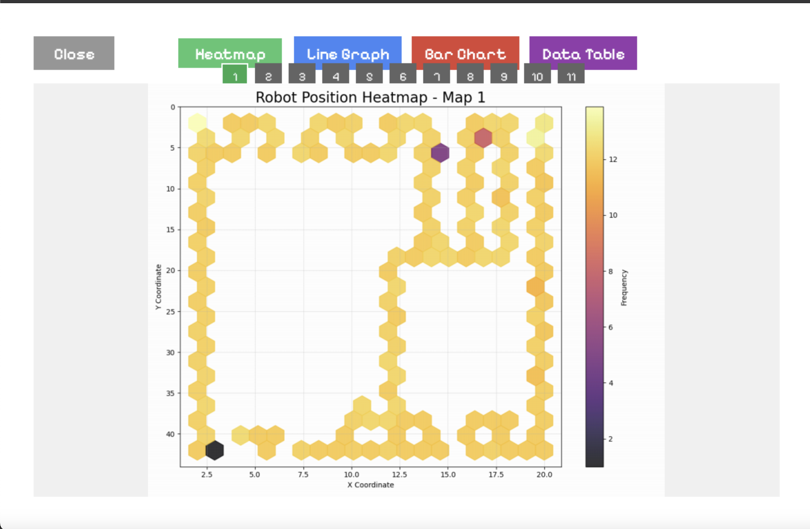

# Nav Card

## Project Overview
Nav Card is a 2D strategy game that combines card selection with algorithmic robot navigation. Players select three cards before starting each level: one for navigation, one for obstacle avoidance, and one for recovery behavior. The chosen algorithms determine how the robot navigates through environments with various obstacles and hazards. The goal is to complete levels within a specified number of recovery attempts and/or achieve the best time, with a leaderboard for comparing performance.

For more project details, see the [DESCRIPTION.md](DESCRIPTION.md) file.

## Game Screenshots

### Gameplay View

### Fan-out Display Mode

### Card Placement View

### Statistics

### Statistics

### Statistics

## Game Mechanics
- At the start of each level, players select one card each for navigation, obstacle avoidance, and recovery behavior
- The robot navigates a 2D map filled with both static and movable obstacles according to the chosen algorithms
- Levels are completed by reaching the goal using the minimum number of recoveries and achieving the best time
- When the game starts, all UI buttons disappear for a cleaner interface, with algorithm operations controlled via keyboard

## Game Objectives
- Complete levels within the specified number of recovery attempts
- Beat time records of previous attempts and other players

## Key Features
1. **Algorithm Selection via Cards**: Instead of predefined robot behaviors, players can select and customize algorithm cards, adding strategic depth
2. **Data Analytics Integration**: Detailed tracking of player performance statistics (e.g., movement efficiency, recovery counts) for analysis and in-depth feedback
3. **Dynamic Environments**: Levels feature dynamically changing obstacles, making real-time algorithm adjustments crucial
4. **Interactive Leaderboards**: Players can compare performance metrics globally, encouraging continuous improvement of algorithm strategies
5. **Clean UI Design**: During gameplay, all UI buttons are hidden for an unobstructed view of algorithm operations
6. **Singleton Pattern Usage**: Game state management uses the Singleton pattern to ensure consistent state across all game components
7. **Login System**: Players can create profiles and store progress, including cards unlocked at different levels
8. **Statistics and Analytics System**: Records and analyzes gameplay data to show performance and gameplay trends

## Project Architecture

### UML Class Diagram

## Algorithm Cards
The game features a variety of algorithm cards that players can choose from:

### Navigation Algorithms
- **DFS (Depth-First Search)** - Explores as far as possible along a branch before backtracking
- **BFS (Breadth-First Search)** - Explores all paths at equal distance from the starting point
- **A*** - Efficient search algorithm that uses heuristics to find the shortest path
- **Dijkstra** - Classic pathfinding algorithm that guarantees the shortest path
- **RRT (Rapidly-exploring Random Tree)** - Randomized algorithm for efficient space exploration

### Collision Avoidance Algorithms
- **DWA (Dynamic Window Approach)** - Considers robot dynamics for smooth obstacle avoidance
- **VFH (Vector Field Histogram)** - Uses a two-dimensional histogram of obstacles for efficient avoidance
- **BUG** - Simple algorithm that runs in a straight line to the goal and turns when encountering obstacles
- **Wall Following** - Simple algorithm that follows walls to navigate around obstacles

### Recovery Behaviors
- **SpinInPlace** - Spins in place to find a clear path
- **StepBack** - Steps backward before trying another path

## Design Patterns
This game utilizes several design patterns to ensure a clean architecture and maintainable code:

1. **Singleton Pattern**: Used for the GameState class to ensure only one instance throughout the application, maintaining consistent game state management
2. **Observer Pattern**: Used for event handling and user interactions, allowing components to respond to changes in game state

## Statistical Tracking
The game tracks the following metrics during gameplay:
1. **Robot Position Tracking**: Records x-y coordinates and distance traveled over time
2. **Recovery Attempts**: Logs each time a recovery action is executed
3. **Level Completion Time**: Total time taken to complete each level
4. **Player Score/Time Records**: Tracks performance metrics for comparison against leaderboards
5. **Obstacle Interactions**: Records number of collisions or interactions with obstacles

## Installation and Usage
1. Clone or download this repository
2. Install required libraries by running `pip install -r requirements.txt`
3. Start the game by running `python main.py`

## Controls
- **Spacebar**: Toggle card view mode
- **Left Click**: Select and place cards
- **Start Button**: Begin simulation once cards are placed
- **Reset Button**: Reset game state to select cards again
- **ESC**: Pause game/resume playing

## Development
This project was developed using Python and Pygame. The system features a card-based interface for algorithm selection, with a clean UI design that hides UI elements during gameplay for better focus on algorithm operation.

## Copyright and License
The Nav Card project is licensed under the [MIT License](LICENSE). See the [LICENSE](LICENSE) file for more details.

## Version
**Version:** 1.0

## Author
Napat Sirichan (6710545571)